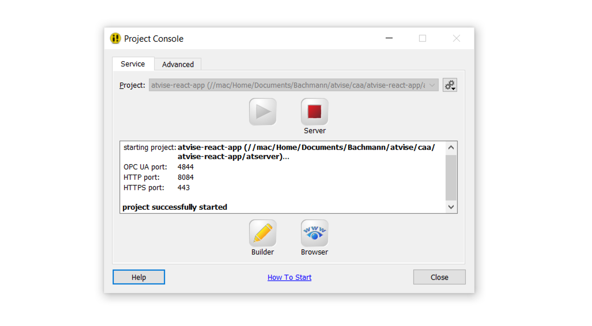
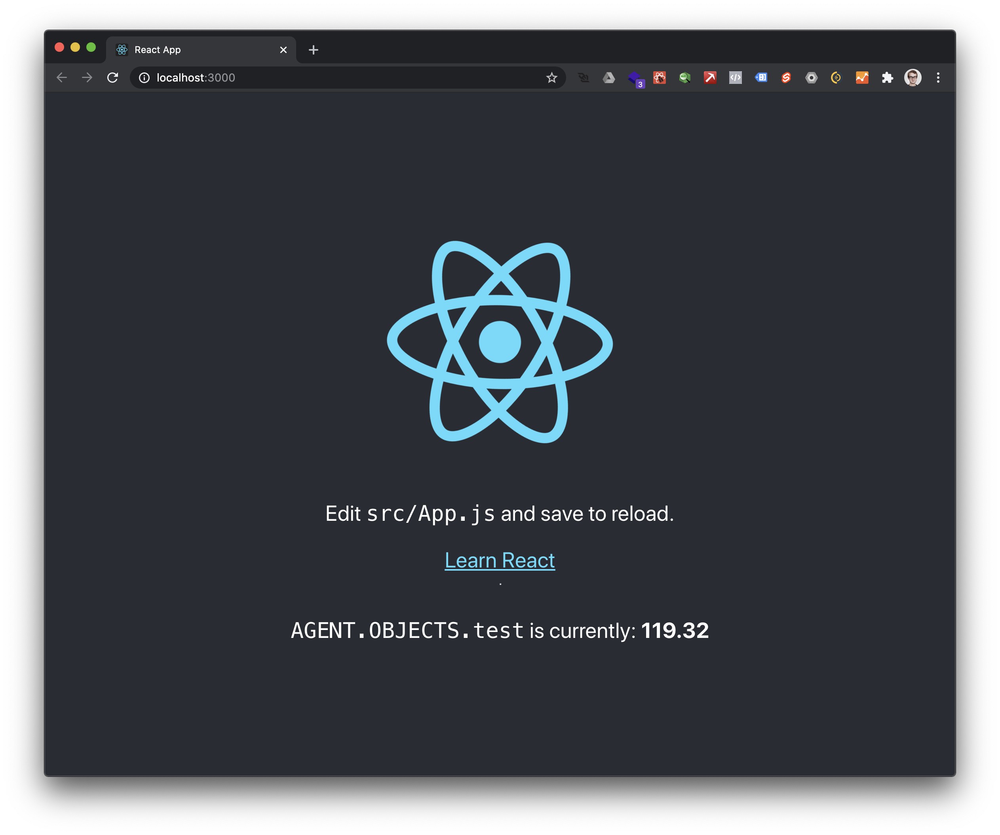
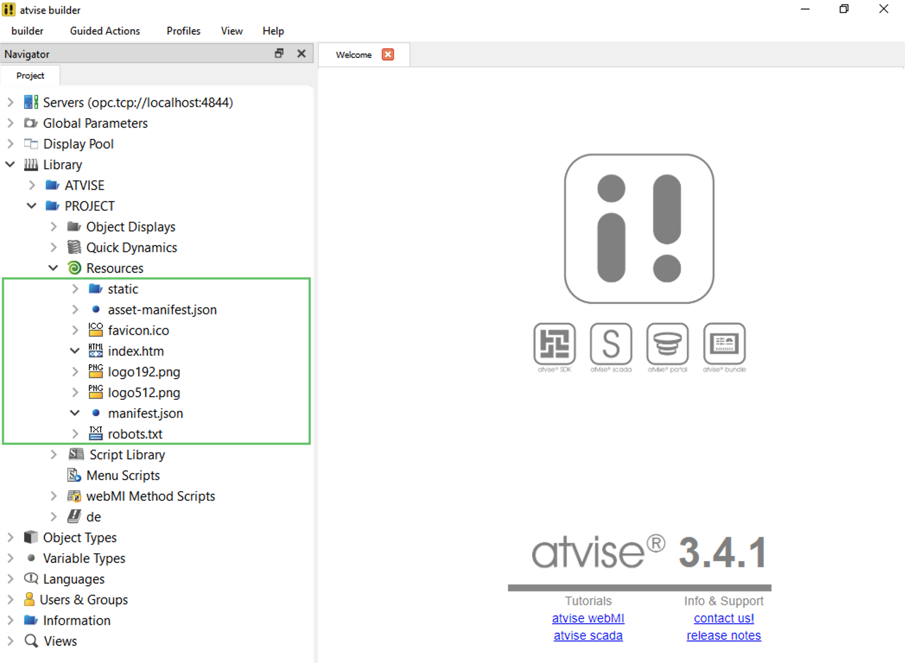

# create-atvise-app

Tools to integrate atvise into your modern web app project.

> **Note:** This project is currently under development.

## Overview

_create-atvise-app_ sets up a modern React development environment for your atvise project in no time. It's built upon facebook's [_create-react-app_](https://create-react-app.dev).

## Quickstart

First, make sure you have [node.js](https://nodejs.org/en/) (version 12 or newer) installed.

> <details>
> <summary>How?</summary>
>
> Run `node --version` on the command line.
>
> ```sh
> node --version
> v12.18.2 # The node.js version installed
> ```
>
> If this command fails or prints a version number lower than _12_ download and install the latest LTS (long term support) version from [nodejs.org](https://nodejs.org/en/).
>
> </details>

Next, run _create-react-app_ to create a new project:

> Don't worry about installing _create-react-app_, `npx` (npm package runner, shipped with node.js) does this for you 😀

```bash
npx create-react-app \
  # Use the atvise template
  --template @atvise/cra-template \
  # Use an adapted version of react-scripts
  --scripts-version @atvise/react-scripts \
  # The folder to create the app in
  my-app

cd my-app
```

Running `create-react-app` will generate the initial project structure and install all the tools and resources required to build and run your app. These are the most important files:

```sh
my-app
├── README.md               # Contains information on how to run the app
├── node_modules            # Contains the app's dependencies
├── package.json            # The app's manifest file
├── .atviserc.json          # Project configuration
├── public                  # Put your static files in here, e.g. images
│   └── index.html          # The file you see when you open your browser
└── src                     # Contains your project's source files
    ├── App.js              # The App component (React)
    └── index.js            # Renders the 'App' component
```

All in all, we have a fully functional React/atvise app at this point, no more configuration required. Let's test it!

First, you have to **start an atvise server** in the `atserver` directory. The easiest way to do so is via the atvise Project Console.

- Create a new project

  

- Select the `atserver` directory as it's path
- Click _OK_ to create it and
- Make sure that the ports _4844_ and _8084_ are selected and start atvise server via the ▶️-Button

  

  Jump to [Configuration](#configuration) if you need to use other ports.

> <details>
> <summary>You can also start atvise server from the command line</summary>
>
> **On Windows**
>
> ```
> "C:\Program Files\atvise\atserver.exe" /proj=%cd% atserver/nodes.db /boot
> ```
>
> **On Linux**
>
> ```
> atserver --proj $(pwd) --boot
> ```
>
> </details>

Now we're ready to start the React development server:

```
npm start
```

This will open your browser and show a fully functional React app, displaying the value of an atvise variable:



## Development

This project makes very little assumptions on how you will develop your React app: You can use almost all UI libraries, routers, internationalization frameworks etc. that work with react.

Additionally, the [`@atvise/webmi-react`](./packages/react) package provides data bindings between your react app and atvise server. For example, you can use the `useSubscription` hook to display a variable's value:

```jsx
import { useSubscription } from '@atvise/webmi-react';

/**
 * @example
 * <MyLabel address="AGENT.OBJECTS.test" />
 */
function MyLabel(props) {
  const { loading, data, error } = useSubscription(props.address);

  if (loading) return <i>loading...</i>;
  if (error) return <i>An error ocurred</i>;

  return <p>AGENT.OBJECTS.test currently is: {data.value}</p>;
}
```

Check out the [`@atvise/webmi-react`](./packages/react) package for details.

## Deployment

You can deploy it to your atvise server by running `npm run deploy`. This command will create a new production build (by running `npm run build`) and upload it to your atvise server's project resources. Afterwards, you should see your react app when you open your atvise server in the browser (usually available at [localhost:8084](http://localhost:8084)).

You can view the deployed files in atvise builder by navigating to the project library's resources:



## Configuration

You can adjust some project settings inside the `.atviserc.json` file. It contains a reference to it's schema, so autocompletion should be available in modern IDEs. These are the most important properties:

| Key         | Description                          | Default       |
| :---------- | :----------------------------------- | ------------- |
| `host`      | The host atvise server is running at | `"localhost"` |
| `port.opc`  | atvise server's OPC-UA port          | `4840`        |
| `port.http` | atvise server's HTTP port            | `80`          |

## Limitations

Using React instead of regular atvise displays and components comes with some drawbacks, too. These are the most important:

- **Regular atvise displays cannot be used** alongside the react app.

  In addition the `webMI.display` API does not work as expected.

- **The graphics functions won't work**

  Don't use `webMI.translate` or `webMI.gfx`. You can do almost everything in CSS instead.

> This project is currently under development so there may be additional incompatibilities we don't know about yet - Feel free to [create an issue](https://github.com/LukasHechenberger/create-atvise-app/issues/new) if you find one.

## What's included?

Currently, we only support **React apps**, but we're planning to add support for Vue and Angular in the future.

<!-- FIXME: Create and link docs on how to use *atvise-scripts* with non-react apps -->

## Packages

The whole project is split into different packages:

<!-- BEGIN packages -->
<!-- This section is generated, do not edit it! -->

| Name                                              | Description                                                                                     |
| :------------------------------------------------ | :---------------------------------------------------------------------------------------------- |
| [@atvise/caa-playground](./examples/playground)   | A playground that allows you to explore the benefits of using React in an atvise project online |
| [atvise-scripts](./packages/atvise-scripts)       | The scripts used by create-atvise-app to interact with atvise server                            |
| [@atvise/modular-webmi](./packages/modular-webmi) | Modular exports for webmi.js                                                                    |
| [@atvise/webmi-react](./packages/react)           | React bindings for webmi                                                                        |
| [@atvise/types-webmi](./packages/types-webmi)     | Type definitions for webmi.js                                                                   |

<!-- END packages -->
